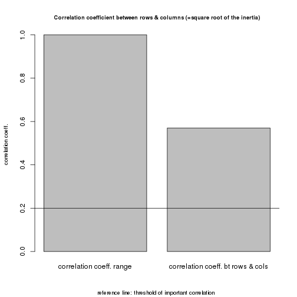
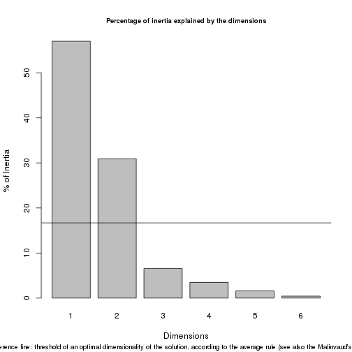
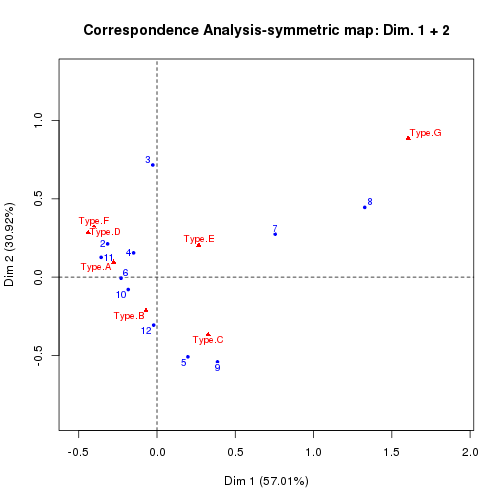

Analyse des correspondances
========================================================
Tutoriel sur l'analyse des corrspondances (AC) en R avec une application pratique a l'archeologie.

source
------
http://cainarchaeology.weebly.com/


```
## Installing packages into '/home/bart-rescue/R/x86_64-redhat-linux-gnu-library/3.0'
## (as 'lib' is unspecified)
```

```
## Error: trying to use CRAN without setting a mirror
```


Aim of Correspondence Analysis
------------------------------

CA is a statistical exploratory tool whose popularity has steadily grown in the social sciences (see, e.g., the papers in Blasius, Greenacre 1998) as well as in archaeology. Even though in the latter field CA has been slow in gaining popularity, with the exception of early groundbreaking studies (Bølviken et al. 1982; Djindjian 1985; Madsen 1989; Gillis 1990), today it is used for many purposes, including intrasite activity areas research (Kuijt, Goodale 2009; Alberti 2012, 2013), burial assemblages analysis (Wallin 2010), on-site distribution of faunal remains (Potter 2000; Morris 2008), distribution of drinking pottery types in the context of cultures contact (Pitts 2005), stratigraphy and formation processes (Mameli et al. 2002; Pavùk 2010), seriation and chronology (Bellanger et al. 2008; Peeples, Schachner 2012).

CA represente graphiuememt les dependance entre les lignes et les colonnes d'une table de contingence. L.affichage visuel des donnees faciite l'interpretation et favorise l'emerence de motifs. La technique reduit le nombre de dimensions necessaires pour afficher les points en decomposant l'inertie totale (ie la variabilite) de la table et en definissant le nombre minimal de dimensions necessaires pour representer la variabilite des donnees.

The graphical output of CA is a scatterplot where rows and/or columns are represented as points in a sequence of low-dimensional spaces. These spaces have the properties to retain a decreasing amount of the total inertia. The first dimension will capture the highest amount, while the second will be associated with the second largest proportion, and so on. 

On the scatterplot, the distance between data points of the same type (i.e., row-to-row) is related to the degree to which the rows have similar profiles (i.e., relative frequencies of column categories). The same applies for the column-to-column distance. The more the points are close to one another, the more similar their profiles will be. The origin of the axes represents the centroid (i.e., the average profile), and can be conceptualized as the “place” where there is no difference between profiles or, more formally (and to recall the chi-square terminology), it represents the hypothesis of homogeneity of the profiles (Greenacre 2007, 32). The more different are the latter, the more the profile points will be spread on the plane away from the centroid. 

As for the relative distances between points of different type (i.e., row-to-column), it tells the analyst something about the “correspondence” between the categories that made up the table. In other words, the more a row point is close to a column point, the greater (i.e., the more distant from the average) is the proportion of that column category on the row profile. 

Outliers are row/column profiles that dramatically deviate from the others, for example, for having very small (or very large) frequencies and/or very few categories. These affect the graphical output of CA. As stressed by Baxter, Cool (2010, 220), these points will lie far away from the rest of the cloud of points, dominating the plot, and causing the other profile points to cluster together. It has to be stressed, however, that the problem is only a matter of graphical layout since it does not affect the determination of the CA dimensions as Greenacre (2007, 269-270; 2011) has demonstrated. It will be shown later on how the “correct” visualization (i.e., not influenced by outliers) and the interpretation of CA plots can be assured even in the presence of outlier profile points. This can be accomplished by using the Greenacre’s Standard Biplot (Greenacre 2007, 101-102; also called Contribution Biplot in Greenacre 2011, 9) that can be easily obtained by the package ‘ca’ via the R script here described.

Association between Rows and Columns
------------------------------------
For illustrative purposes, a contingency table is created with 12 rows and 7 columns. It represents the fictional distribution of seven pottery types across twelve sites. The analyst’s interest could lie in understanding if a correspondence exists between sites and pottery types; in other words, whether types are evenly distributed across sites, or if a pattern of association exists between sites and types. This will be accomplished by means of CA. 


```
##       Site Type.A Type.B Type.C Type.D Type.E Type.F Type.G
## 1   Site 1      5     33     48      2     19      3     14
## 2   Site 2     28     31     16     19     12     30      2
## 3   Site 3      5      1      3      6      3      7      3
## 4   Site 4     15     16     13      9      9     14      2
## 5   Site 5     15     23     42      5      5      2      1
## 6   Site 6     21     24     12      9      1      9      2
## 7   Site 7      5     10     11      1      6      3      8
## 8   Site 8      2      5     17      0      8      2     13
## 9   Site 9      2     21     26      0      5      3      2
## 10 Site 10     10     23     24      9      6     21      0
## 11 Site 11     24     30     17     14      9     30      0
## 12 Site 12     11     25     21      5      7      6      0
```

The preliminary interest could be in the strength of association between rows and columns of the table. This information is provided by a bar chart.It shows the magnitude of the correlation coefficient on the right side, compared with the overall range (0.0-1.0) of the coefficient (on the left). A reference line indicates the threshold (0.20) above which the correlation can be considered important (Bendixen 1995, 576; Healey 2013, 289-290). 



On notera que le coefficient de correlation est la racine carree de la table d'inertie  et il s'avère correspondre au coefficient phi utilisé pour mesurer la force de l'association entre deux variables catégorielles (Greenacre 2007, 28, 61).

Dans notre exemple, le coefficient de corrélation est égal à 0,57 indiquant une forte association (Healey 2013, 289). Il convient également de noter que l'existence d'une dépendance significative entre les lignes et les colonnes pourrait être testé par le test du chi-carré (sur ce test voir, Cool, Baxter 2005; Drennan 2009 182-188). Dans notre cas, il se révèle être significatif (chi-carré: 319,92; df: 66; p <0,001).

Nombre de dimensions utile pour l'interpretation des donnees
-------------------------------------------------------------

It has to be stressed that this is one of the “thorniest” problem (Preacher et al. 2013, 29) affecting CA as well as Factor Analysis, Principal Components Analysis (PCA) and Multidimensional Scaling (see, e.g., Jackson 1993; Wilson, Cooper 2008; Van Pool, Leonard 2011, 296-299). As stressed by Hair et al. (2009, 591), in selecting the optimal number of dimensions the analyst is faced with the need of a trade-off between the increasing explained data variability deriving by keeping many dimensions versus the increasing complexity that can make difficult the interpretation of more than two dimensions. Like for other techniques, for which a number of approaches exists each having its pros and cons (overviews in Worthington, Whittaker 2006, 820-822; Wilson, Cooper 2008), also in CA there is no clear-cut rule guiding the analyst’s choice (Lorenzo-Seva 2011, 97) and different approaches have been proposed.

A more informal approach leans toward considering the number of useful dimensions fixed by the very analyst’s ability to give meaningful interpretation of the retained axes (Benzécri 1992, 398; Blasius, Greenacre 1998, 25; Yelland 2010, 13). In other words, dimensions that cannot be sensibly interpreted can be considered the result of random fluctuations among the residuals (Clausen 1998, 25). 

Another approach would be to keep as many dimensions as necessary to account for the majority of the total inertia, setting a cut-off threshold at an arbitrary level, say 90% (see, in the context of Factor Analysis, Van Pool, Leonard 2011, 296). On the other hand, Hair et al. (2009, 591) suggest that dimensions whose inertia is greater than 0.2 (in terms of eigenvalue) should be included in the analysis. 

Another frequently used method is the inspection of the scree plot, adapted from the context of PCA (Cattell 1966). Dimensions are plotted in order of the decreasing amount of explained inertia, resulting in a falling curve. The point at which the latter shows a bend (so called “elbow”) can be considered as indicating an optimal dimensionality (e.g., Clausen 1998, 24; Drennan 2009, 286-288; Van Pool, Leonard 2011, 296-297). It is worthy of note that this method has been found to perform fairly well (Zwick, Velicer 1986, 440; Bandalos, Boehm-Kaufman 2009, 81; Lorenzo-Seva 2011, 97). 

The average rule, as termed by Lorenzo-Seva (2011, 97), is yet another method, which is equivalent to the Kaiser’s rule in the context of PCA (Wilson, Cooper 2008, with references). According to this rule, analysts should retain all the dimensions that explain more than the average inertia (expressed in terms of percentages), the latter being equal to 100 divided by the number of dimensions (i.e., the number of rows or columns, whichever is smaller, minus 1). Unfortunately, in the context of PCA, this method seems to overestimate the dimensionality of the solution (Wilson, Cooper 2008, 866; Lorenzo-Seva 2011, 97). 

Saporta (2006, 209-210) has suggested the use of the Malinvaud’s test as guidance for the dimensionality of the CA solution (see also Camiz, Gomes 2013, 12). In practice, referring to Saporta’s book or Camiz-Gomez’s article for the computational details (see also Rakotomalala 2013, 7), this sequential test checks the significance of the remaining dimensions once the first k ones have been selected. Unfortunately, as As stressed by Saporta himself and empirically tested by Rakotomalala (2013), it seems tends to overestimate the number of dimensions as the table’s grand total increases.

Finally, Lorenzo-Seva (2011) has interestingly adapted to CA a method developed for PCA, called Parallel Analysis. Its rationale is that nontrivial dimensions should explain a larger percentage of inertia than the dimensions derived from random data. While this method outperforms the aforementioned average rule, it seems to suggest a dimensionality of the solution comparable to the one that can be derived from the scree plot, at least in the illustrative example discussed by the scholar (Lorenzo-Seva 2011, 101, fig. 1).

In front of the sizable number of different approaches, each one having its pros and cons, I would lean toward a middle ground as to the problem of the dimensionality of the CA solution, trying to conciliate formal testing, on the one hand, with conceptual interpretability as dimension-retention criterion, on the other hand. I would agree with Worthington, Whittaker (2006, 822) who lucidly state that “in the end, researchers should retain a factor only if they can interpret it in a meaningful way no matter how solid the evidence for its retention”. In their opinion, exploratory approaches are “ultimately a combination of empirical and subjective approaches to data analysis because the job in not complete until the solution makes sense”. Within this general framework, I would also agree with Bandalos, Boehm-Kaufman (2009, 80-81) as to the need to compare and find a balance between different methods, provided that one deals always with significant factors according to the chi-square statistic. 

The methods provided by the script are the average rule,  the scree plot, and the Malinvaud’s test. A fourth criterion, namely the retention of dimensions whose eigenvalue is greater than 0.2 (sensu Hair et al. 2009 previously quoted), can be easily put to work thanks to the script output (via the ‘ca’ package), as will be described shortly. The reason for the choice of these methods rests on their wide use in literature, the good performance of the second (even compared to the aforementioned Parallel Analysis), and the opportunity to provide the users with the possibility to compare at least four of the criterions previously illustrated.  

As for the average rule in the context of our worked example, any axis contributing more than the average percentage of inertia (100/11=9% in terms of rows, 100/6=16.7% in term of columns) should be considered important for the interpretation of the data (see, e.g., Bendixen 1995, 577).  It must be acknowledged, however, that interesting patterns can emerge by inspecting more than just the first two dimensions, as rightly stressed by Baxter (1994, 120). With this warning in mind, the bar chart provided by the script can be used as a guidance in the choice of the relevant dimensions. 



Dimensions are plotted in order of the decreasing amount of explained inertia. A reference line represents the threshold above which a dimension can be considered important according to the average rule. In our case, a 2-dimensional solution seems appropriate, with the first explaining over 60% of the inertia, and the second about 20%. It must be noted that the threshold represented by the reference line is also indicated in a specific section of the script’s textual output. 

The same chart can be read off as a scree plot: the point at which a bend is evident in the falling curve described by the histograms can be taken as indicating an (not the) optimal dimension. It is worthy  notinge that the number of dimensions suggested by the chart, once it is read off as a scree plot, is consistent with the dimensionality suggested by the average rule. 

The result of the Malinvaud’s test is also reported. 


In our case, only the first three dimensions seems to be important since their p value is below 0.05, while the other three have a value equal to 0.167, 0.573 and 0.825 respectively.

Finally, as far as the greater-than-0.2 rule is concerned, the dimensions complying with that criterion can be located by inspecting the script’s textual output, which reports the list of dimensions with associated eigenvalues (after the ‘ca’ package). According to this rule, only the first dimension, accounting for more than half of the total inertia (i.e., 63.5%), should be retained. 

The difference between the four methods underscoress the need to compare and find a balance between multiple dimension-retention criterions. In our case, a 2 or 3-dimensional solution seems appropriate.

Interpreting the CA scatterplot: dimensions interpretation
----------------------------------------------------------

The script provides the symmetric plots (rows and columns; rows only, columns only) for the first four dimensions. The plots are obtained from the ‘ca’ package. The plot, showing the row (point) and column (triangle) profile points at the same time, is reproduced. 




