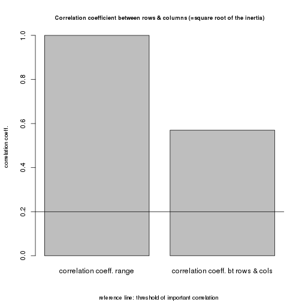
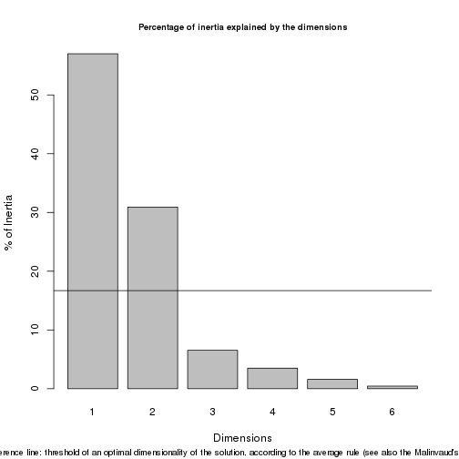
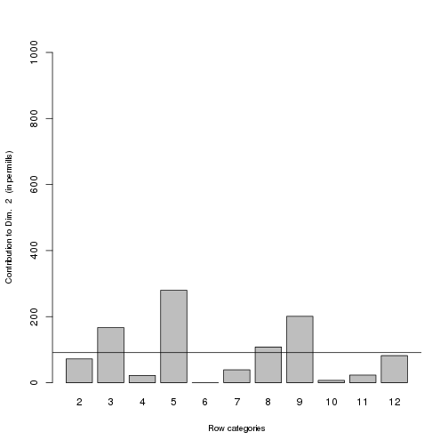
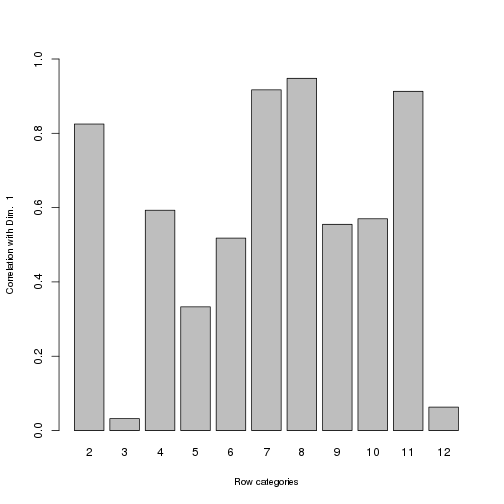
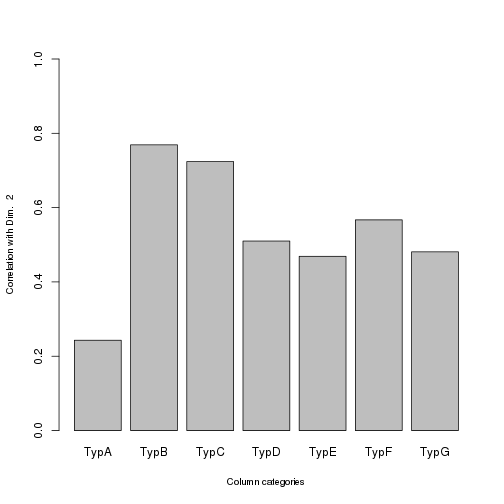

demo1
========================================================

Traduction de ac.R en markdown

Utilise le fichier exemple.csv. Ce fichier comporte des intitule de lignes et de colonnes, alors que la demo semble ne fonctionner qu'avec une matrice.

Chargement des librairies necessaires
------------------------------------


lecture du fichier
------------------
Noter la formulation pour parcourir une arborescence de fichiers. Ici on code le nom du fichier en dur.

```r
# read data from choosen table
f <- "exemple1.csv"
# mydata <- read.table(file=file.choose(), header=TRUE, sep=',')
mydata <- read.table(file = f, header = TRUE, sep = ",")
# retrecit le tableau pour eliminer les intitules lignes et colonne
mydata <- mydata[2:12, 2:8]
```


get some details about the input table
--------------------------------------

```r
grandtotal <- sum(mydata)
nrows <- nrow(mydata)
ncols <- ncol(mydata)
numb.dim.cols <- ncol(mydata) - 1
numb.dim.rows <- nrow(mydata) - 1
a <- min(numb.dim.cols, numb.dim.rows)  #dimensionality of the table
labs <- c(1:a)  #set the numbers that will be used as x-axis' labels on the Malinvaud's test scatterplot

# contingency table as matrix
mydataasmatrix <- as.matrix(mydata)

# contingency table w/ row and columns profiles
data.w.rowsum <- addmargins(mydataasmatrix, 1)
data.w.colsum <- addmargins(mydataasmatrix, 2)

# Number of dimensions according to the average rule
c.dim <- round(100/(ncols - 1), digits = 1)
r.dim <- round(100/(nrows - 1), digits = 1)
thresh.sig.dim <- (max(c.dim, r.dim))
dataframe.after.ca <- summary(ca(mydata))
n.dim.average.rule <- length(which(dataframe.after.ca$scree[, 3] >= thresh.sig.dim))
```

Test de Malinvaud
-----------------

```r
# Malinvaud's Test
malinv.ca <- CA(mydata, ncp = a, graph = FALSE)
malinv.test.rows <- a
malinv.test.cols <- 6
malinvt.output <- matrix(ncol = malinv.test.cols, nrow = malinv.test.rows)
colnames(malinvt.output) <- c("K", "Dimension", "Eigen value", "Chi-square", 
    "df", "p value")
malinvt.output[, 1] <- c(0:(a - 1))
malinvt.output[, 2] <- c(1:a)
for (i in 1:malinv.test.rows) {
    k <- -1 + i
    malinvt.output[i, 3] <- malinv.ca$eig[i, 1]
    malinvt.output[i, 5] <- (nrows - k - 1) * (ncols - k - 1)
}
malinvt.output[, 4] <- rev(cumsum(rev(malinvt.output[, 3]))) * grandtotal
malinvt.output[, 6] <- round(pchisq(malinvt.output[, 4], malinvt.output[, 5], 
    lower.tail = FALSE), digits = 6)
optimal.dimensionality <- length(which(malinvt.output[, 6] <= 0.05))
```


plot bar chart of correlation between rows and columns, and add reference line
------------------------------------------------------------------------------

```r
# plot bar chart of correlation between rows and columns, and add reference
# line dev.new()
perf.corr <- (1)
sqr.trace <- round(sqrt(sum(dataframe.after.ca$scree[, 2])), digits = 3)
barplot(c(perf.corr, sqr.trace), main = "Correlation coefficient between rows & columns (=square root of the inertia)", 
    sub = "reference line: threshold of important correlation ", ylab = "correlation coeff.", 
    names.arg = c("correlation coeff. range", "correlation coeff. bt rows & cols"), 
    cex.main = 0.8, cex.sub = 0.8, cex.lab = 0.8)
abline(h = 0.2)
```

 


plot bar chart of inertia explained by the dimensions
-----------------------------------------------------

```r
# plot bar chart of inertia explained by the dimensions, and add reference
# line corresponding to the Average Rule threshold
barplot(dataframe.after.ca$scree[, 3], xlab = "Dimensions", ylab = "% of Inertia", 
    names.arg = dataframe.after.ca$scree[, 1])
abline(h = thresh.sig.dim)
title(main = "Percentage of inertia explained by the dimensions", sub = "reference line: threshold of an optimal dimensionality of the solution, according to the average rule (see also the Malinvaud's test Plot)", 
    cex.main = 0.8, cex.sub = 0.8)
```

 

Malinvaud's test Plot
---------------------

```r
# Malinvaud's test Plot
plot(malinvt.output[, 6], type = "o", xaxt = "n", xlim = c(1, a), xlab = "Dimensions", 
    ylab = "p value")
axis(1, at = labs, labels = sprintf("%.0f", labs))
title(main = "Malinvaud's test Plot", sub = "dashed line: alpha 0.05 threshold", 
    col.sub = "RED", cex.sub = 0.8)
abline(h = 0.05, lty = 2, col = "RED")
```

 

Nombre de dimension a afficher
------------------------------
Normalement le programme interroge de maniere interactive l'utilisateur. Ici on fixe a 2 le nombre de dimension a afficher (noter la rechnique pour poser une question et attendre la reponse)

```
## -The input Table has 11 Rows and 7 Columns
```

 

```
## -The Correlation Coefficient btw Rows and Columns is 0.57
```

 

```
## -The total number of dimensions is 6
```

 

```
## -The Average Rule indicates that the number of relevant dimensions is 2
```

 

```
## -The Malinvaud's Test indicates that the number of relevant dimensions is 2
```

 

```
## -The Malinvaud's Test details are the following:
```

 

```
##      K Dimension Eigen value Chi-square df p value
## [1,] 0         1    0.185297    278.563 60  0.0000
## [2,] 1         2    0.100495    119.764 45  0.0000
## [3,] 2         3    0.021254     33.640 32  0.3879
## [4,] 3         4    0.011375     15.425 21  0.8010
## [5,] 4         5    0.005168      5.677 12  0.9315
## [6,] 5         6    0.001456      1.248  5  0.9402
```

```
## note: the analysis' output showing up on the console will be also saved as .txt file in this directory:  /home/bart-rescue/Documents/JCB/R/acp
```

 


CA analysis by Greenacre's package
----------------------------------

```r
# CA analysis by Greenacre's package to be used later on for the Standard
# Biplots
res.ca <- ca(mydata, nd = dims.to.be.plotted)

# CA output as dataframe to be used for the some graphs to come
cadataframe <- summary(ca(mydata, nd = dims.to.be.plotted))

# plot the quality of the display of categories on successive pairs of
# dimensions row categories dev.new()
counter <- 1
for (i in seq(9, ncol(cadataframe$rows), 3)) {
    counter <- counter + 1
    quality.rows <- (cadataframe$rows[, 6] + cadataframe$rows[, i])/10
    barplot(quality.rows, ylim = c(0, 100), xlab = "Row categories", ylab = paste("Quality of the display (% of inertia) on Dim. 1+", 
        counter), names.arg = cadataframe$rows[, 1], cex.lab = 0.8)
}
```

 


column categories
------------------

```r
# column categories
dev.new()
counter <- 1
for (i in seq(9, ncol(cadataframe$columns), 3)) {
    counter <- counter + 1
    quality.cols <- (cadataframe$columns[, 6] + cadataframe$columns[, i])/10
    barplot(quality.cols, ylim = c(0, 100), xlab = "Column categories", ylab = paste("Quality of the display (% of inertia) on Dim. 1+", 
        counter), names.arg = cadataframe$columns[, 1], cex.lab = 0.8)
}
```


charts of categories contribution
---------------------------------

```r
# charts of categories contribution plot bar charts of contribution of row
# categories to the axes, and add a reference line dev.new()
counter <- 0
for (i in seq(7, ncol(cadataframe$rows), 3)) {
    counter <- counter + 1
    barplot(cadataframe$rows[, i], ylim = c(0, 1000), xlab = "Row categories", 
        ylab = paste("Contribution to Dim. ", counter, " (in permills)"), names.arg = cadataframe$rows[, 
            1], cex.lab = 0.8)
    abline(h = round(((100/nrows) * 10), digits = 0))
}
```

  


plot bar charts of contribution of column categories to the axes
----------------------------------------------------------------

```r
# plot bar charts of contribution of column categories to the axes, and add
# a reference line dev.new()
counter <- 0
for (i in seq(7, ncol(cadataframe$columns), 3)) {
    counter <- counter + 1
    barplot(cadataframe$columns[, i], ylim = c(0, 1000), xlab = "Column categories", 
        ylab = paste("Contribution to Dim. ", counter, " (in permills)"), names.arg = cadataframe$columns[, 
            1], cex.lab = 0.8)
    abline(h = round(((100/ncols) * 10), digits = 0))
}
```

  


correlation of categories to dimensions
---------------------------------------

```r
# correlation of categories to dimensions row categories dev.new()
counter <- 0
for (i in seq(6, ncol(cadataframe$rows), 3)) {
    counter <- counter + 1
    correl.rows <- round(sqrt((cadataframe$rows[, i]/1000)), digits = 3)
    barplot(correl.rows, ylim = c(0, 1), xlab = "Row categories", ylab = paste("Correlation with Dim. ", 
        counter), names.arg = cadataframe$rows[, 1], cex.lab = 0.8)
}
```

  


column categories
-----------------

```r
# column categories dev.new()
counter <- 0
for (i in seq(6, ncol(cadataframe$columns), 3)) {
    counter <- counter + 1
    correl.cols <- round(sqrt((cadataframe$columns[, i]/1000)), digits = 3)
    barplot(correl.cols, ylim = c(0, 1), xlab = "Column categories", ylab = paste("Correlation with Dim. ", 
        counter), names.arg = cadataframe$columns[, 1], cex.lab = 0.8)
}
```

  


CA graphical outputs:
---------------------

```r
# symmetric plots from FactoMineR package dev.new()
counter <- 1
for (i in 2:dims.to.be.plotted) {
    counter <- counter + 1
    plot(malinv.ca, axes = c(1, i), shadow = TRUE, cex = 0.8, invisible = "none", 
        title = paste("Correspondence Analysis-symmetric map: Dim. 1 +", counter))
    plot(malinv.ca, axes = c(1, i), shadow = TRUE, cex = 0.8, invisible = "col", 
        title = paste("Correspondence Analysis-symmetric rows map: Dim. 1 +", 
            counter))
    plot(malinv.ca, axes = c(1, i), shadow = TRUE, cex = 0.8, invisible = "row", 
        title = paste("Correspondence Analysis-symmetric cols map: Dim. 1 +", 
            counter))
}
```

   


```r
# asymmetric biplots (Standard Biplots) from Greenacre's package: rows in
# principal coordinates and columns in standard coordinates times square
# root of the mass (Greenacre 2007, pp. 102, 234, 268, 270). NOTE: The
# lenght of each arrow joining the column points to the origin is
# proportional to the contribution that each column category makes to the
# principal axes; colour intensity proportional to the absolute contribution
# to the total inertia dev.new()
counter <- 1
for (i in 2:dims.to.be.plotted) {
    counter <- counter + 1
    plot(res.ca, mass = FALSE, dim = c(1, i), contrib = "none", col = c("black", 
        "red"), map = "rowgreen", arrows = c(FALSE, TRUE), main = paste("Correspondence Analysis-standard biplot: Dim. 1 +", 
        counter))
    plot(res.ca, mass = FALSE, dim = c(1, i), contrib = "none", col = c("black", 
        "red"), map = "colgreen", arrows = c(TRUE, FALSE), main = paste("Correspondence Analysis-standard biplot: Dim. 1 +", 
        counter))
    plot(res.ca, mass = FALSE, dim = c(1, i), contrib = "absolute", col = c("black", 
        "red"), map = "rowgreen", arrows = c(FALSE, TRUE), main = paste("Correspondence Analysis-standard biplot: Dim. 1 +", 
        counter), sub = "colour intensity proportional to the absolute contribution to the inertia", 
        cex.sub = 0.7)
    plot(res.ca, mass = FALSE, dim = c(1, i), contrib = "absolute", col = c("black", 
        "red"), map = "colgreen", arrows = c(TRUE, FALSE), main = paste("Correspondence Analysis-standard biplot: Dim. 1 +", 
        counter), sub = "colour intensity proportional to the absolute contribution to the inertia", 
        cex.sub = 0.7)
}
```

    


plots for row clusters
----------------------

```r
## clustering after FactoMiner package:
ca.factom <- CA(mydata, ncp = dims.to.be.plotted, graph = FALSE)
resclust.rows <- HCPC(ca.factom, nb.clust = -1, metric = "euclidean", method = "ward", 
    order = TRUE, graph.scale = "inertia", graph = FALSE, cluster.CA = "rows")
resclust.cols <- HCPC(ca.factom, nb.clust = -1, metric = "euclidean", method = "ward", 
    order = TRUE, graph.scale = "inertia", graph = FALSE, cluster.CA = "columns")

# plots for row clusters 2D scatterplots
for (i in 2:dims.to.be.plotted) {
    plot(resclust.rows, axes = c(1, i), choice = "map", draw.tree = FALSE, ind.names = TRUE, 
        new.plot = TRUE)
}
```

 

```r
# 3D scatterplots
for (i in 2:dims.to.be.plotted) {
    plot(resclust.rows, axes = c(1, i), choice = "3D.map", draw.tree = TRUE, 
        ind.names = TRUE, new.plot = TRUE)
}
```

 

```r
# clusters tree
plot(resclust.rows, choice = "tree", rect = TRUE, new.plot = TRUE)
```

  

```r

# plots for column clusters 2D scatterplots
for (i in 2:dims.to.be.plotted) {
    plot(resclust.cols, axes = c(1, i), choice = "map", draw.tree = FALSE, ind.names = TRUE, 
        new.plot = TRUE)
}
# 3D scatterplots
for (i in 2:dims.to.be.plotted) {
    plot(resclust.cols, axes = c(1, i), choice = "3D.map", draw.tree = TRUE, 
        ind.names = TRUE, new.plot = TRUE)
}
# clusters tree
plot(resclust.cols, choice = "tree", rect = TRUE, new.plot = TRUE)
```

   


```
##  Correspondence Analysis script by Gianmarco ALBERTI 
##     (gianmarcoalberti@tin.it)
##     (www.xoomer.alice.it/gianmarco.alberti)
```

                                       

```
## script executed on Fri Nov  8 18:11:13 2013
```

                                       

```
## number of dimensions to be analyzed selected by the user: 2
```

                                       
                                       

```
##  * Start of Correspondence Analysis output *
```

```
## ...................................................................
```

                                       

```
## ================================================================
```

```
## Contingency Table
```

```
## ================================================================
```

```
##     Type.A Type.B Type.C Type.D Type.E Type.F Type.G Sum
## 2       28     31     16     19     12     30      2 138
## 3        5      1      3      6      3      7      3  28
## 4       15     16     13      9      9     14      2  78
## 5       15     23     42      5      5      2      1  93
## 6       21     24     12      9      1      9      2  78
## 7        5     10     11      1      6      3      8  44
## 8        2      5     17      0      8      2     13  47
## 9        2     21     26      0      5      3      2  59
## 10      10     23     24      9      6     21      0  93
## 11      24     30     17     14      9     30      0 124
## 12      11     25     21      5      7      6      0  75
## Sum    138    209    202     77     71    127     33 857
```

                                        

```
## ================================================================
```

```
## Row profiles (%)
```

```
## ================================================================
```

```
##     Type.A Type.B Type.C Type.D Type.E Type.F Type.G
## 2    20.29  22.46  11.59  13.77   8.70  21.74   1.45
## 3    17.86   3.57  10.71  21.43  10.71  25.00  10.71
## 4    19.23  20.51  16.67  11.54  11.54  17.95   2.56
## 5    16.13  24.73  45.16   5.38   5.38   2.15   1.08
## 6    26.92  30.77  15.38  11.54   1.28  11.54   2.56
## 7    11.36  22.73  25.00   2.27  13.64   6.82  18.18
## 8     4.26  10.64  36.17   0.00  17.02   4.26  27.66
## 9     3.39  35.59  44.07   0.00   8.47   5.08   3.39
## 10   10.75  24.73  25.81   9.68   6.45  22.58   0.00
## 11   19.35  24.19  13.71  11.29   7.26  24.19   0.00
## 12   14.67  33.33  28.00   6.67   9.33   8.00   0.00
## Sum  16.10  24.39  23.57   8.98   8.28  14.82   3.85
```

                                        

```
## ================================================================
```

```
## Column profiles (%)
```

```
## ================================================================
```

```
##    Type.A Type.B Type.C Type.D Type.E Type.F Type.G   Sum
## 2   20.29  14.83   7.92  24.68  16.90  23.62   6.06 16.10
## 3    3.62   0.48   1.49   7.79   4.23   5.51   9.09  3.27
## 4   10.87   7.66   6.44  11.69  12.68  11.02   6.06  9.10
## 5   10.87  11.00  20.79   6.49   7.04   1.57   3.03 10.85
## 6   15.22  11.48   5.94  11.69   1.41   7.09   6.06  9.10
## 7    3.62   4.78   5.45   1.30   8.45   2.36  24.24  5.13
## 8    1.45   2.39   8.42   0.00  11.27   1.57  39.39  5.48
## 9    1.45  10.05  12.87   0.00   7.04   2.36   6.06  6.88
## 10   7.25  11.00  11.88  11.69   8.45  16.54   0.00 10.85
## 11  17.39  14.35   8.42  18.18  12.68  23.62   0.00 14.47
## 12   7.97  11.96  10.40   6.49   9.86   4.72   0.00  8.75
```

                                        

```
## ================================================================
```

```
## Association coefficients
```

```
## ================================================================
```

```
##                     X^2 df P(> X^2)
## Likelihood Ratio 259.62 60        0
## Pearson          278.56 60        0
## 
## Phi-Coefficient   : 0.57 
## Contingency Coeff.: 0.495 
## Cramer's V        : 0.233
```

                                        

```
## ================================================================
```

```
## Chi-square test
```

```
## ================================================================
```

```
## Warning: Chi-squared approximation may be incorrect
```

```
## 
## 	Pearson's Chi-squared test
## 
## data:  mydata
## X-squared = 278.6, df = 60, p-value < 2.2e-16
```

                                        

```
## ================================================================
```

```
## Association between rows and columns
```

```
## ================================================================
```

                                        

```
## Total Inertia:
```

```
## [1] 0.325
```

                                        

```
## Square root of the Total Inertia:
```

```
## [1] 0.57
```

                                        

```
## note: 
##     The square root of the Total Inertia may be interpreted as a correlation coefficient (phi) between the rows and columns. 
##     Any value greater 0.20 indicates important dependency (see also the bar chart provided).
```

                                        

```
## ================================================================
```

```
## Correspondence Analysis summary
```

```
## ================================================================
```

```
## 
## Principal inertias (eigenvalues):
## 
##  dim    value      %   cum%   scree plot               
##  1      0.185297  57.0  57.0  *************************
##  2      0.100495  30.9  87.9  *************            
##  3      0.021254   6.5  94.5  ***                      
##  4      0.011375   3.5  98.0  *                        
##  5      0.005168   1.6  99.6  *                        
##  6      0.001456   0.4 100.0                           
##         -------- -----                                 
##  Total: 0.325045 100.0                                 
## 
## 
## Rows:
##      name   mass  qlt  inr    k=1 cor ctr    k=2 cor ctr  
## 1  |    2 |  161  990   72 | -315 681  86 |  213 309  72 |
## 2  |    3 |   33  827   62 |  -27   1   0 |  716 825 167 |
## 3  |    4 |   91  731   18 | -149 352  11 |  155 378  22 |
## 4  |    5 |  109  849  117 |  197 111  23 | -509 738 280 |
## 5  |    6 |   91  269   55 | -229 268  26 |   -7   0   0 |
## 6  |    7 |   51  953  107 |  755 841 158 |  275 111  39 |
## 7  |    8 |   55  999  331 | 1327 898 521 |  446 101 108 |
## 8  |    9 |   69  914  103 |  386 308  55 | -542 605 201 |
## 9  |   10 |  109  386   35 | -184 325  20 |  -79  60   7 |
## 10 |   11 |  145  937   68 | -357 833  99 |  126 105  23 |
## 11 |   12 |   88  789   32 |  -21   4   0 | -306 785  82 |
## 
## Columns:
##     name   mass  qlt  inr    k=1 cor ctr    k=2 cor ctr  
## 1 | TypA |  161  568   75 | -278 509  67 |   94  59  14 |
## 2 | TypB |  244  655   58 |  -70  64   6 | -214 592 111 |
## 3 | TypC |  236  938  187 |  327 414 136 | -368 524 318 |
## 4 | TypD |   90  886   85 | -440 626  94 |  284 260  72 |
## 5 | TypE |   83  601   48 |  267 381  32 |  203 220  34 |
## 6 | TypF |  148  833  145 | -403 512 130 |  319 322 150 |
## 7 | TypG |   39  990  402 | 1604 759 535 |  886 231 301 |
```

                                        

```
## ================================================================
```

```
## Guide to the number of Dimensions to take into account
```

```
## ================================================================
```

                                        

```
## Any axis contributing more than the following percentage should be regarded as important for the interpretation:
```

```
## [1] 16.7
```

                                        

```
## note: 
##     For comparison, see the % provided in the Correspondence Analysis summary (above) as well as the bar chart provided.
##     Besides this rule (i.e. the average rule) see also the Malinvaud's Test table (below) and plot
```

                                        

```
## ================================================================
```

```
## Malinvaud's Test table
```

```
## ================================================================
```

```
##      K Dimension Eigen value Chi-square df p value
## [1,] 0         1    0.185297    278.563 60  0.0000
## [2,] 1         2    0.100495    119.764 45  0.0000
## [3,] 2         3    0.021254     33.640 32  0.3879
## [4,] 3         4    0.011375     15.425 21  0.8010
## [5,] 4         5    0.005168      5.677 12  0.9315
## [6,] 5         6    0.001456      1.248  5  0.9402
```

                                        
                                        

```
## ================================================================
```

```
## Dimensionality of the solution. Average rule vs Malinvaud's test:
```

```
## ================================================================
```

```
## The Average rule suggests an optimal dimensionality equal to 2 dimensions
```

                                        

```
## The Malinvaud's test suggests an optimal dimensionality equal to 2 dimensions
```

                                        
                                        
                                        

```
## ================================================================
```

```
## Major contributors to the definition of dimensions
```

```
## ================================================================
```

                                        

```
## Any category whose contribution is greater than the following figures (in permills) contributes to the definition of the principal axes:
```

                                        

```
## Rows contribution threshold
```

```
## [1] 91
```

                                        

```
## Columns contribution threshold
```

```
## [1] 143
```

                                        

```
## note:
```

```
## You have to decide whether interpreting row categories in columns space, or viceversa. 
##     Then, according to your decision, see which row or column categories have major contribution to the definition of the axes by locating the ones whose contribution is greater than the above threshold. 
##     For categories' contribution, see: (a) the figures provided in the Correspondence Analysis summary (above) under the label 'ctr'; (b) the charts provided.
##     Besides, take into account the sign of the coordinates of the category points (under the 'k' label in the CA summary above) to understand which pole (positive and negative) of the axes the categories are actually determining.
##     Further, after having 'given names' to the axes according to the (row or column) categories relevant to their definition, take a look at the correlation bar chart (provided) in order to understand with which dimension the categories have strong correlation (see Greenacre 2007, p. 86).
```

                                        

```
## ================================================================
```

```
## Clusters description (after FactoMineR)
```

```
## ================================================================
```

                                        

```
## Row clusters
```

```
## ____________
```

```
##       Dim 1     Dim 2 clust
## 11 -0.35678  0.126378     1
## 2  -0.31548  0.212527     1
## 6  -0.22922 -0.006764     1
## 10 -0.18365 -0.079141     1
## 4  -0.14947  0.154850     1
## 3  -0.02658  0.716218     1
## 12 -0.02118 -0.306425     2
## 5   0.19734 -0.508983     2
## 9   0.38641 -0.541571     2
## 7   0.75490  0.274552     3
## 8   1.32684  0.445649     3
```

                                        

```
## Column clusters
```

```
## _______________
```

```
##           Dim 1   Dim 2 clust
## Type.D -0.43970  0.2836     1
## Type.F -0.40281  0.3194     1
## Type.A -0.27765  0.0944     1
## Type.B -0.07024 -0.2140     2
## Type.E  0.26705  0.2027     2
## Type.C  0.32726 -0.3680     2
## Type.G  1.60435  0.8859     3
```

                                        
                                        
                                        

```
## ***************************************************************
```

```
## *             List of the Plots provided by this Script       *
```

```
## ***************************************************************
```

```
## Window 1: -Bar chart of the strenght of the correlation between rows and columns of the input crosstab
##     -Bar chart of the percentage of Inertia explained by the dimensions
##     -Malinvaud Test Plot
##     (note: the Script will plot only the Dimensions that are significant according to the Malinvaud Test)
##     
##     Window 2: -Bar charts of the Quality of the diplay of Row categories on pairs of successive dimensions
##     
##     Window 3: -Bar charts of the Quality of the diplay of Column categories on pairs of successive dimensions
##     
##     Window 4: -Bar charts of the Contribution of Row categories to the Dimensions
##     
##     Window 5: -Bar charts of the Contribution of Column categories to the Dimensions
##     
##     Window 6: -Bar charts of the Correlation of Row categories with the Dimensions
##     
##     Window 7: -Bar charts of the Correlation of Column categories with the Dimensions
##     
##     Window 8: -CA symmetric Map displaying both Row and Column points
##     -CA symmetric Map for Rows only
##     -CA symmetric Map for Columns only
##     (note: the total number of charts in this Windows depends on the number of Dimensions that have been plotted)
##     
##     Window 9: -CA Standard Biplots
##     
##     Windows from 10 onward: -2D CA Maps with clustering (for Rows)
##     -3D CA Map with clustering (for Rows)
##     -Clusters Tree with indication of group membership (for Rows)
##     -2D CA Maps with clustering (for Columns)
##     -3D CA Map with clustering (for Columns)
##     -Clusters Tree with indication of group membership (for Columns)
##     (note: the total number of 2D and 3D charts depends on the number of Dimensions that have been plotted)
## 
```

                                        
                                        
                                        

```
## ***************************************************************
```

```
## *                 Note on the Standard Biplot                 *
```

```
## ***************************************************************
```

                                        

```
## Rows in principal coordinates and columns in standard coordinates times square root of the mass. (Greenacre 2007, pp. 102, 234, 268, 270). 
##     The lenght of each arrow joining the column points to the origin is proportional to the contribution that each column category makes to the principal axes; colour intensity proportional to the absolute contribution to the total inertia.
##     
##     See: Greenacre 2007, pp. 101-103, 234, 268, 270; Greenacre 2010, pp. 87-88; Greenacre 2013
```

                                        

```
## Reference:
```

```
## Greenacre 2007: Greenacre M., 'Correspondence Analysis in Practice'. Second Edition. Boca Raton-London-New York, Chapman&Hall/CRC
##     Greenacre 2010: Greenacre M., 'Biplots in Practice', Fundacion BBVA
##     Greenacre 2013: Greenacre M., 'Contribution Biplots', Journal of Computational and Graphical Statistics 22(1)
```

                                     

```
## ...................................................................
```

```
##  * End of Correspondence Analysis output *
```


